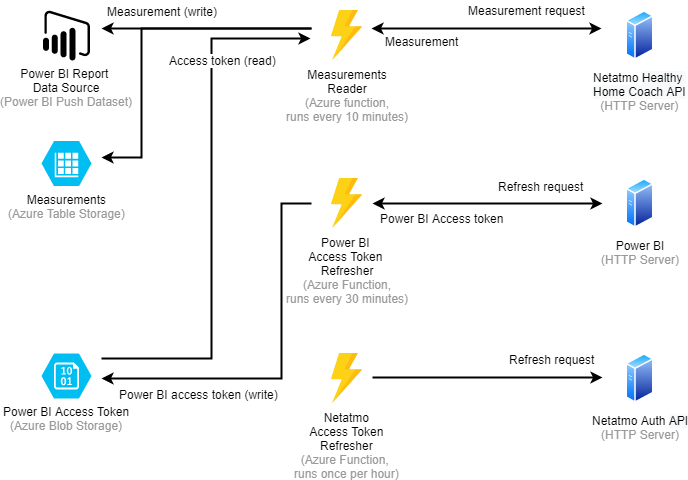

# Overview

# Configuration

- Local development environment is configured via `local.settings.json` file. See `local.settings.template.json` for the list of configuration variables.
- Azure environment uses the same variables and is configured via Application settings in Azure portal.
